# WordForge

**Forge your WordPress site through conversation.**

> ⚠️ **EXPERIMENTAL SOFTWARE** ⚠️
>
> This project is in active development and **may break your WordPress installation**. Before using WordForge:
>
> - **Ensure you have direct access to your server** (SSH, FTP, or hosting panel)
> - **Create a full backup** of your WordPress files and database
> - **Test on a staging environment first** — never on production without testing
> - **Understand what you're doing** — WordForge can create, modify, and delete content
>
> By using this software, you accept full responsibility for any changes made to your WordPress site. The authors provide no warranty and accept no liability for data loss or site damage.

---

## What is WordForge?

WordForge is an AI-powered WordPress management toolkit built on the [Model Context Protocol (MCP)](https://modelcontextprotocol.io/). It lets you control your WordPress site through natural conversation with AI assistants like Claude, OpenCode, or any MCP-compatible client.

### What's Inside

WordForge consists of three packages:

| Package | Description |
|---------|-------------|
| **WordForge Desktop** | **(Recommended)** Desktop app to manage sites, run the MCP server, and view rapid stats (Jetpack/WooCommerce). |
| **WordPress Plugin** | Exposes WordPress abilities (content, media, blocks, styles, WooCommerce) via the MCP protocol |
| **MCP Server** | Node.js server for Claude Desktop and other MCP clients |
| **Admin UI** | React-based chat interface built into WordPress admin |

### Capabilities

- **Content Management** — Create, edit, list, and delete posts, pages, and custom post types
- **Media Library** — Upload, update, and manage media files with SEO metadata
- **Gutenberg Blocks** — Read and modify page block structures programmatically
- **Templates (FSE)** — Manage Full Site Editing templates and template parts
- **Theme Styling** — Update global styles (theme.json) for colors, typography, spacing
- **Taxonomy** — Manage categories, tags, and custom taxonomies
- **WooCommerce** — Full product CRUD (auto-detected when WooCommerce is active)
- **Analytics (Jetpack)** — Retrieve traffic stats, insights, top posts, search terms, and more (requires Jetpack)
- **AI Prompts** — Built-in prompt templates for content generation and SEO optimization

---

## How to Use WordForge

There are three ways to interact with WordForge:

### Option A: WordForge Desktop (Recommended)

The **WordForge Desktop App** is the fastest way to get started. It bundles the OpenCode MCP server and provides a unified dashboard for all your WordPress sites.

**Why use the Desktop App?**
- **Easy Setup**: Embeds OpenCode locally—no complex server configuration or terminal commands required.
- **Rapid Stats**: Get an "at a glance" view of your site's performance (Jetpack stats, WooCommerce sales) without logging into the WordPress admin.
- **Connection Helper**: Provides easy tools to connect your WordPress sites via deep links.
- **Bridge**: Acts as a bridge for the WordPress Admin chat interface (perfect for local environments or shared hosting where running a server process is difficult).

### Option B: WordPress Admin Interface

Use the built-in chat interface directly in your WordPress admin. WordForge can download and run [OpenCode](https://github.com/sst/opencode) on your server, providing three integration points:

| Interface | Location | Use Case |
|-----------|----------|----------|
| **Chat Page** | WordForge → Chat | Full-featured chat for complex tasks |
| **Floating Widget** | Posts, Pages, Products, Media lists | Quick context-aware assistance |
| **Editor Sidebar** | Gutenberg block editor | Help while editing content |

**Best for:** Content editors, non-technical users, quick edits

```
┌─────────────────────────────────────────────────────────────┐
│                    WordPress Admin                          │
│  ┌─────────────┐  ┌─────────────┐  ┌─────────────────────┐  │
│  │ Chat Page   │  │   Widget    │  │  Editor Sidebar     │  │
│  │             │  │     💬      │  │    ┌──────────┐     │  │
│  │  Full chat  │  │   Floating  │  │    │ AI Help  │     │  │
│  │  interface  │  │   button    │  │    └──────────┘     │  │
│  └─────────────┘  └─────────────┘  └─────────────────────┘  │
│                           │                                  │
│                           ▼                                  │
│                 ┌─────────────────┐                         │
│                 │ OpenCode Server │  (runs on your server)  │
│                 └─────────────────┘                         │
└─────────────────────────────────────────────────────────────┘
```

#### Specialized AI Agents

The WordPress admin interface uses a **multi-agent system** where a primary orchestrator delegates to specialized subagents:

```mermaid
flowchart TB
    User([User Message]) --> Manager

    subgraph Agents["Agent Hierarchy"]
        Manager["🎯 WordPress Manager<br/><small>Primary orchestrator</small>"]
        
        Manager -->|"Content creation"| Creator["✍️ Content Creator<br/><small>Blog posts, landing pages, legal pages</small>"]
        Manager -->|"Site analysis"| Auditor["🔍 Auditor<br/><small>SEO audits, performance reviews</small>"]
        Manager -->|"Products"| Commerce["🛒 Commerce Manager<br/><small>WooCommerce products, inventory</small>"]
        Manager -->|"Simple tasks"| Manager
    end

    Manager --> Tools[(MCP Tools<br/>WP-CLI<br/>File Read)]
    Creator --> Tools
    Auditor --> Tools
    Commerce --> Tools
```



| Agent | Role | Handles |
|-------|------|---------|
| **WordPress Manager** | Primary orchestrator | Delegates work, handles theme/styling, simple lookups |
| **Content Creator** | Writing specialist | Blog posts, landing pages, legal pages (Privacy Policy, Terms), SEO-optimized content in Gutenberg block format |
| **Auditor** | Analysis specialist | SEO audits, content reviews, performance recommendations, site health checks |
| **Commerce Manager** | WooCommerce specialist | Product CRUD, inventory management, pricing, categories *(only when WooCommerce is active)* |

Grealty inspired by the agents from [oh-my-opencode](https://github.com/code-yeongyu/oh-my-opencode) by [@justsisyphus](https://x.com/justsisyphus)

#### Automatic Context Injection

Each agent receives **live WordPress context** so the AI understands your site:

```
📍 Site Information
   ├── Site name, URL, WordPress version, language
   ├── Root directory path
   
🎨 Active Theme
   ├── Theme name and version
   ├── Block theme (FSE) or Classic theme
   ├── Child theme info (if applicable)
   
🔌 Active Plugins
   ├── List of active plugins with versions
   ├── WooCommerce status (enables Commerce Manager)
   
📝 Content Types
   ├── Available post types (post, page, custom...)
   ├── Available taxonomies (categories, tags, custom...)
   
🛠️ CLI Tools
   └── WP-CLI availability
```

This context is injected into every agent prompt, so when you ask "create a landing page," the AI knows your theme, available blocks, and site language.

#### Configurable AI Models

Each agent can use a different AI model. Configure in **WordForge → Settings → Agents**:

| Agent | Recommended Models | Why |
|-------|-------------------|-----|
| **WordPress Manager** | Claude Opus, GPT-4 | Complex orchestration needs top-tier reasoning |
| **Content Creator** | Gemini Pro, Claude Sonnet, GPT-4o | Creative writing, long-form content |
| **Auditor** | Claude Haiku, Gemini Flash | Fast analysis, structured output |
| **Commerce Manager** | Claude Sonnet, Gemini Pro | Balanced reasoning for product data |

**Default**: If no API keys are configured, agents use `opencode/big-pickle` (OpenCode's hosted model).

#### Provider Setup

Configure AI providers in **WordForge → Settings → Providers**:

- **Anthropic** — Claude models (Opus, Sonnet, Haiku)
- **OpenAI** — GPT-4o, GPT-4 Turbo
- **Google** — Gemini Pro, Gemini Flash
- **[OpenCode Zen](https://opencode.ai/zen)** — Hosted models (no API key needed)

---

### Option C: MCP Client (Claude Desktop, OpenCode, etc.)

Use WordForge from your local machine with any MCP-compatible AI client. The AI connects to your WordPress site remotely and can manage content through natural language.

**Best for:** Developers, power users, bulk operations, complex workflows

```
┌─────────────────┐      MCP Protocol      ┌─────────────────┐
│  Claude Desktop │  ◄──────────────────►  │   WordPress +   │
│  or OpenCode    │                        │   WordForge     │
└─────────────────┘                        └─────────────────┘
     Your Machine                              Your Server
```

## Installation

### 1. WordPress Plugin (Required)

1. Download `wordforge.zip` from the [latest release](https://github.com/KONFeature/wordforge/releases)
2. In WordPress admin, go to **Plugins → Add New → Upload Plugin**
3. Upload the zip file and click **Install Now**
4. Activate the plugin

**Requirements:**
- PHP 8.0+
- WordPress 6.8+

### 2. Desktop App (Recommended)

1. Download the installer for your OS from the [latest release](https://github.com/KONFeature/wordforge/releases).
2. Install and launch the application.
3. Use the "Connect Site" button to easily link your WordPress installation.

### 3. MCP Tool (Optional - for Manual Setup)

If you prefer to use WordForge from an external MCP client manually (without the Desktop App):

#### Claude Desktop

1. Download `wordforge.mcpb` from the [latest release](https://github.com/KONFeature/wordforge/releases)
2. Double-click the file or drag it into Claude Desktop
3. Configure your WordPress credentials when prompted

#### OpenCode CLI

Add to your `.opencode.json` (project) or `~/.config/opencode/config.json` (global):

**Remote MCP (direct connection to WordPress):**
```json
{
  "mcp": {
    "wordpress": {
      "enabled": true,
      "type": "remote",
      "url": "https://yoursite.com/wp-json/wordforge/mcp",
      "headers": {
        "Authorization": "Basic <base64-encoded-credentials>"
      }
    }
  }
}
```

Generate base64 credentials:
```bash
echo -n "username:application-password" | base64
```

**Local MCP Server (recommended):**

Download `wordforge-server.js` from the [latest release](https://github.com/KONFeature/wordforge/releases):

```json
{
  "mcp": {
    "wordpress": {
      "enabled": true,
      "type": "local",
      "command": ["node", "./path/to/wordforge-server.js"],
      "environment": {
        "WORDPRESS_URL": "https://yoursite.com/wp-json/wp-abilities/v1",
        "WORDPRESS_USERNAME": "your-username",
        "WORDPRESS_APP_PASSWORD": "xxxx xxxx xxxx xxxx xxxx xxxx"
      }
    }
  }
}
```

#### Other MCP Clients

Run the server directly:

```bash
WORDPRESS_URL="https://yoursite.com/wp-json/wp-abilities/v1" \
WORDPRESS_USERNAME="your-username" \
WORDPRESS_APP_PASSWORD="xxxx xxxx xxxx xxxx xxxx xxxx" \
node wordforge-server.js
```

---

## Configuration

### WordPress Credentials

**Abilities API URL**
```
https://yoursite.com/wp-json/wp-abilities/v1
```

**MCP URL (for remote connections)**
```
https://yoursite.com/wp-json/wordforge/mcp
```

### Creating an Application Password

1. Go to **Users → Profile** in WordPress admin
2. Scroll to **Application Passwords**
3. Enter a name (e.g., "WordForge") and click **Add New Application Password**
4. Copy the generated password (spaces are fine)

### Environment Variables

| Variable | Description |
|----------|-------------|
| `WORDPRESS_URL` | Your site's Abilities API endpoint |
| `WORDPRESS_USERNAME` | WordPress admin username |
| `WORDPRESS_APP_PASSWORD` | Application password (with or without spaces) |
| `WORDFORGE_EXCLUDE_CATEGORIES` | Comma-separated categories to exclude: `content`, `blocks`, `styles`, `media`, `taxonomy`, `templates`, `woocommerce`, `prompts` |
| `WORDFORGE_DEBUG` | Set to `true` for verbose logging |

### WordPress Admin Settings

Visit **WordForge → Settings** in WordPress admin to:
- Configure AI providers (for built-in chat)
- Manage OpenCode server (start/stop, auto-shutdown)
- View registered abilities
- Check WooCommerce integration status

---

## Available Abilities

### Content Management

| Tool | Description |
|------|-------------|
| `wordforge/list-content` | List posts, pages, or custom post types with filtering |
| `wordforge/get-content` | Get a single content item by ID or slug |
| `wordforge/save-content` | Create or update content |
| `wordforge/delete-content` | Delete or trash content |

### Media Library

| Tool | Description |
|------|-------------|
| `wordforge/list-media` | List media library items with filtering |
| `wordforge/get-media` | Get media details including all sizes |
| `wordforge/upload-media` | Upload media from URL or base64 |
| `wordforge/update-media` | Update alt text, title, caption, description |
| `wordforge/delete-media` | Delete a media item |

### Taxonomy

| Tool | Description |
|------|-------------|
| `wordforge/list-terms` | List terms for any taxonomy |
| `wordforge/save-term` | Create or update a term |
| `wordforge/delete-term` | Delete a term |

### Gutenberg Blocks

| Tool | Description |
|------|-------------|
| `wordforge/get-page-blocks` | Get block structure of a page (full or simplified) |
| `wordforge/update-page-blocks` | Update page blocks (auto-creates revision) |

### Templates (FSE)

| Tool | Description |
|------|-------------|
| `wordforge/list-templates` | List block templates and template parts |
| `wordforge/get-template` | Get template with block content |
| `wordforge/update-template` | Update template content |

### Theme Styling

| Tool | Description |
|------|-------------|
| `wordforge/get-global-styles` | Get theme.json global styles |
| `wordforge/update-global-styles` | Update global styles (colors, typography, spacing) |
| `wordforge/get-block-styles` | Get registered block style variations |

### WooCommerce

*Only available when WooCommerce is active.*

| Tool | Description |
|------|-------------|
| `wordforge/list-products` | List products with filtering |
| `wordforge/get-product` | Get product details |
| `wordforge/save-product` | Create or update a product |
| `wordforge/delete-product` | Delete a product |

### Analytics (Jetpack)

*Only available when Jetpack is active and connected.*

| Tool | Description |
|------|-------------|
| `wordforge/get-jetpack-stats` | Retrieve site stats, insights, top posts, search terms, and more |

### AI Prompts

| Prompt | Description |
|--------|-------------|
| `wordforge/generate-content` | Generate blog posts, pages with SEO optimization |
| `wordforge/review-content` | Review and improve existing content |
| `wordforge/seo-optimization` | Analyze content for SEO improvements |

---

## Architecture

### OpenCode Server Lifecycle

When using the WordPress admin chat interface, WordForge manages an OpenCode server on your WordPress host:


**Key Components:**
- **BinaryManager** — Downloads platform-specific OpenCode binary from GitHub releases
- **ServerProcess** — Spawns/stops the OpenCode server, manages PID and port files
- **ActivityMonitor** — Tracks last activity, triggers auto-shutdown via WP-Cron
- **OpenCodeController** — REST API for status, start/stop, and proxying requests

### Request Flow (WordPress Admin → OpenCode → Abilities)

When you send a message in the WordPress admin chat:


**Three Ways OpenCode Interacts with WordPress:**

| Method | Use Case | Examples |
|--------|----------|----------|
| **MCP Tools** | CRUD operations via Abilities API | Create posts, upload media, update styles |
| **File Read** | Inspect theme/plugin code, configs | Read `style.css`, `functions.php`, `wp-config.php` |
| **WP-CLI** | Admin commands, diagnostics | `wp plugin list`, `wp option get`, `wp db query` |

**Sandboxed Bash Commands:**

OpenCode can only execute read-only commands (configured in `ServerProcess.php`):

```
Allowed: cat, head, tail, grep, find, ls, tree, pwd, diff, file, stat, du
         git status/log/diff/show, wp *, composer show/info
Denied:  rm, mv, cp, chmod, chown, curl, wget, and all other commands
```

This allows the AI to understand your WordPress setup without modifying files directly — all changes go through the safe, capability-checked Abilities API.

### Config Generation

When OpenCode starts, WordForge generates a config with:


### Project Structure

```
wordforge/
├── packages/
│   ├── php/                  # WordPress plugin
│   │   ├── includes/
│   │   │   ├── Abilities/    # MCP abilities (Content, Media, Blocks, etc.)
│   │   │   ├── Admin/        # WordPress admin UI (Chat, Widget, Settings)
│   │   │   ├── Mcp/          # MCP server integration
│   │   │   └── OpenCode/     # Binary manager, server process, activity monitor
│   │   └── wordforge.php     # Plugin entry point
│   ├── mcp/                  # Node.js MCP server (for external clients)
│   │   └── src/
│   │       ├── index.ts      # Server bootstrap
│   │       ├── abilities-client.ts  # WordPress API client
│   │       └── ability-loader.ts    # Ability → MCP tool transformer
│   └── ui/                   # React admin interface
│       └── src/
│           ├── chat/         # Full chat interface
│           ├── widget/       # Floating widget
│           ├── editor/       # Gutenberg sidebar
│           └── settings/     # Settings page
└── package.json              # Bun monorepo root
```

---

## License

MIT License

Copyright (c) 2025 KONFeature

Permission is hereby granted, free of charge, to any person obtaining a copy
of this software and associated documentation files (the "Software"), to deal
in the Software without restriction, including without limitation the rights
to use, copy, modify, merge, publish, distribute, sublicense, and/or sell
copies of the Software, and to permit persons to whom the Software is
furnished to do so, subject to the following conditions:

The above copyright notice and this permission notice shall be included in all
copies or substantial portions of the Software.

THE SOFTWARE IS PROVIDED "AS IS", WITHOUT WARRANTY OF ANY KIND, EXPRESS OR
IMPLIED, INCLUDING BUT NOT LIMITED TO THE WARRANTIES OF MERCHANTABILITY,
FITNESS FOR A PARTICULAR PURPOSE AND NONINFRINGEMENT. IN NO EVENT SHALL THE
AUTHORS OR COPYRIGHT HOLDERS BE LIABLE FOR ANY CLAIM, DAMAGES OR OTHER
LIABILITY, WHETHER IN AN ACTION OF CONTRACT, TORT OR OTHERWISE, ARISING FROM,
OUT OF OR IN CONNECTION WITH THE SOFTWARE OR THE USE OR OTHER DEALINGS IN THE
SOFTWARE.
